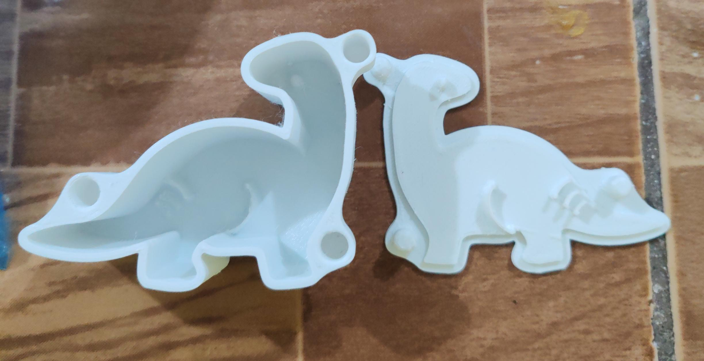

<!DOCTYPE html>
<html lang="es">
<head>
  <meta charset="UTF-8" />
  <meta name="viewport" content="width=device-width, initial-scale=1.0"/>
  <title>Innovaciones Verde Vital</title>
  
</head>
<body>

  <header>
    
  </header>

  <section class="info-table">
    <h2>Información General de la Empresa</h2>
    <table>
      <tr><th>Nombre de la empresa</th><td>JAKSI</td></tr>
      <tr><th>Producto | Servicio</th><td>MOLDES PARA JABON DE PVC</td></tr>
      <tr><th>Sector económico</th><td>Agrícola</td></tr>
      <tr><th>Actividad económica</th><td>Cultivo de plantas no perennes: - Lechuga romana - Lechuga Iceberg - Lechuga Batavia - Lechuga de hoja suelta - Lechuga Mantequilla - Lechuga de primavera</td></tr>
      <tr><th>Teléfono</th><td>2234-5678</td></tr>
      <tr><th>Celular</th><td>7514-3220</td></tr>
      <tr><th>Correo electrónico</th><td>jaksi.itca@gmail.com atencionalcliente@jaksi.com</td></tr>
      <tr><th>Ubicación</th><td>Jayaque, La Libertad Oeste</td></tr>
      <tr><th>Año de inicio</th><td>Enero 2025</td></tr>
      <tr><th>Fecha de formalización</th><td>1 Febrero 2025</td></tr>
      <tr><th>Clasificación MYPE</th><td>Mediana Empresa</td></tr>
    </table>
  </section>

<section class="galeria">
    
  </section>
  
  <section class="galeria">
    
  </section>

  <section class="tienda">
    <h2>Tienda en Línea</h2>
    

      

        
        
FRODO

        <input type="number" min="1" value="1">
        <button onclick="agregarAlCarrito('Lechuga Romana', this)">Agregar</button>
      

      

        
        
GANDALF

        <input type="number" min="1" value="1">
        <button onclick="agregarAlCarrito('Lechuga Romana Empaquetada', this)">Agregar</button>
      

      

        
        
LEGOLAS

        <input type="number" min="1" value="1">
        <button onclick="agregarAlCarrito('Lechuga Iceberg', this)">Agregar</button>
      

      

        
        
ARAGON

        <input type="number" min="1" value="1">
        <button onclick="agregarAlCarrito('Lechuga Iceberg Empaquetada', this)">Agregar</button>
      

      

        
        
ESMIGOL

        <input type="number" min="1" value="1">
        <button onclick="agregarAlCarrito('Batavia', this)">Agregar</button>
      

      

        
        
DINO

        <input type="number" min="1" value="1">
        <button onclick="agregarAlCarrito('Lechuga Mantequilla', this)">Agregar</button>
      

      

        
        
CABALLITO

        <input type="number" min="1" value="1">
        <button onclick="agregarAlCarrito('Lechuga de hoja suelta', this)">Agregar</button>
      

    

  </section>

  <section class="valores">
    
  </section>

  <section class="formulario">
    <h2>Formulario de Contacto</h2>
    <form>
      <label for="nombre">Nombre:</label>
      <input type="text" id="nombre" name="nombre" required>

      <label for="email">Correo electrónico:</label>
      <input type="email" id="email" name="email" required>

      <label for="mensaje">Mensaje:</label>
      <textarea id="mensaje" name="mensaje" rows="4" required></textarea>

      <button type="submit">Enviar</button>
    </form>
  </section>

  <footer>
    
&copy; 2025 Innovaciones jaksi. Todos los derechos reservados.

  </footer>

  <!-- Icono carrito -->
  

    🛒
    
0

  

  <!-- Panel carrito -->
  

    <h3>Tu Carrito</h3>
    <ul id="listaCarrito"></ul>
    
<strong>Total: $0.00</strong>

    <button onclick="vaciarCarrito()">Vaciar</button>
    <button onclick="abrirFormularioDatos()">Finalizar compra</button>
  

  <!-- Modal datos de compra -->
  

    

      &times;
      <h3>Datos de Compra</h3>
      <form onsubmit="confirmarPago(event)">
        <label>Nombre del Cliente:</label>
        <input type="text" id="cliente-nombre" required>

        <label>Correo Electrónico:</label>
        <input type="email" id="cliente-email" required>

        <label>Dirección de Entrega:</label>
        <textarea id="cliente-direccion" rows="3" required></textarea>

        <button type="submit">Confirmar Pedido</button>
      </form>
    

  

  
</body>
</html>
